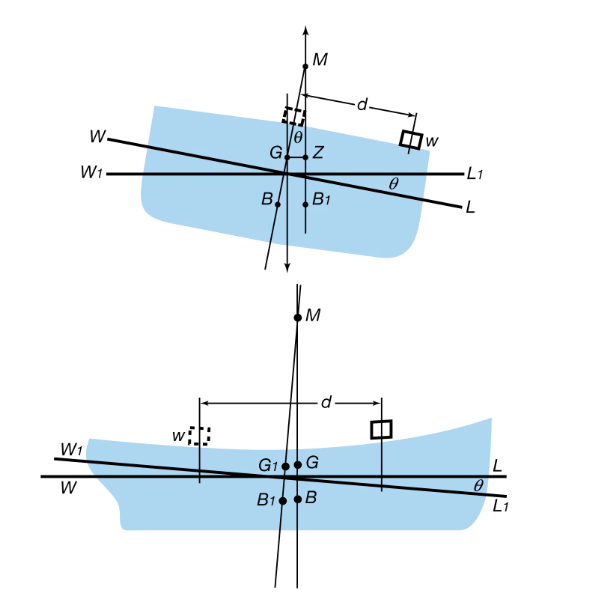
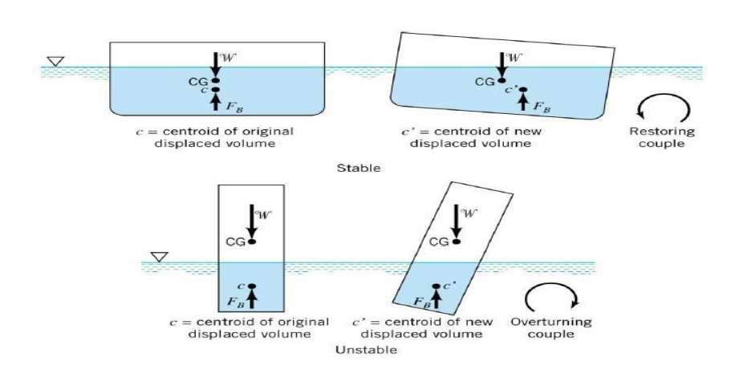

This folder has 

### Aim: 

To determine experimentally the metacentric height of a flat bottomed pontoon.

### THEORY

This experiment is based on the Archimedes principle. Archimedes’ principle is a law of physics fundamental to fluid dynamics. 
“It states that the upward buoyant force exerted on a body immersed in a fluid, whether wholly or partially submerged, is equal to the weight of the fluid that the body displaces and acts in the upward direction at the center of mass of the displaced fluid.”
If the weight of the fluid displaced is less than the weight of the object, the object will sink. The object will float if the weight of the fluid displaced is equal to the weight of the object. This upward force is known as thrust or buoyant force. It is a consequence of the difference in pressure the fluid exerts at different heights. The fluid pressure is exerted in all directions (Pascal’s principle) and increases with depth. There is an unbalanced upward force on the bottom of a submerged object.
Archimedes’ principle tells us that this loss of weight is equal to the weight of the fluid, wholly or partially, displaced by the object. The corresponding equation is given by,
Fb = ρ × g × V
Where,

Fb is the buoyant force (or thrust)
ρ is the density of the fluid in which the object is immersed
V is the volume of the object that is submerged in the fluid
g is the acceleration due to gravity

Buoyancy: When a body is immersed in a fluid either wholly of partially, it is buoyed or lifted up by a force, which is equal to the weight of fluid displaced by the body.

Centre of Buoyancy: The point of application of the force of buoyancy on the body is known as the centre of buoyancy. It is always the centre of gravity of the volume of fluid displaced.

Metacentre: Figure shows a body floating in a liquid in a state of equilibrium. When it is given a small angular displacement, it starts oscillating about some point M. This point, about which the body oscillating, it is called metacentre. 

The metacentre may also be defined as a point of intersection of the axis of body passing through centre of gravity G and original centre of buoyancy B and a vertical line passing through the centre of buoyancy B1 of the tilled position of the body. 

## Applications of this experiment are:

•	A ship or a boat can float on water because the weight of the displaced water is equal to the weight of the ship or boat.
•	A submarine can dive into the water or can float on it. A submarine consists of ballast tanks that are filled with air or water. The tanks weigh less than an equal volume of water and make the sub float on the surface. If the tanks are partly filled with air, it is possible to make the submarine float at some depth of the water without either rising or sinking.
•	Hot air balloons rise into the air because the density of the warmer air inside the balloon is less dense than the colder air outside. The basic principle of hot air balloon is the use of hot air to create buoyancy, which generates lift.
•	Water striders can float on the water since its legs expel water, and the weight of the expelled water is equal to the floating force.

### Determination of Metacentric Height
A known weight W1 is shifted by a distance Z across the axis of tilt. The change in momentum due to this shift is W1 Z. Let the angle of tilt be θ. The change in moment due to this tilt is equal to (Wc + W1) GM tanθ.

Wc = weight of the vessel 
W1 = weight of unbalanced mass 
Z = distance of the unbalanced mass from the centre of the cross bar. 

## EXPERIMENTAL SET UP:

The experimental set up consists of a pontoon (flat bottomed vessel) which is allowed of float in a M.S. tank. The weight of the vessel is kept fix here. By means of a pendulum (consisting of a weight suspended to a longer pointer), the angle of tilt θ can be measured on a graduated arc. For tilting the ship model a cross bar with four movable hangers is fixed on the model. Pendulum and graduated arc are suitably fixed at the centre of the cross bar.

### PROCEDURE

1.	The relevant dimensions as area of collecting tank, mass density of water etc are provided in the data table.
2.	The water level in the tank when pontoon is not in the tank are provided in the data table.

3.	Pontoon is allowed to float in the tank. The reading of water level in the tank is recorded in table.

4. Mass of pontoon can be obtained by the help of Archimedes’s principle.
5.	Position of unbalanced mass, weight of unbalanced mass and the angle of heel can be noted down
6. Calculate the metacentric height of the pontoon.
7. The procedure is repeated for other positions of the unbalanced mass.

### RESULTS

The metacentric height of a flat bottom pontoon =

### PRECAUTIONS

1.	Apparatus should be in leveled conditions.
2.	Reading must be taken in steady condition of water.
3.	Unbalanced mass should be measured by taking care that water disturbance should be minimum.
