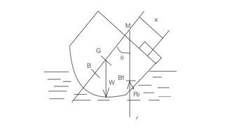
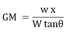

For a body to be in equilibrium on the liquid surface the two forces gravity force (Fg) and buoyant force (Fb) must lie in the same vertical line. If the point M is above G, the floating body will be in stable equilibrium. If slight angular displacement is given to the floating body in clockwise direction, the center of buoyancy shifts from B to B1 such that the line of action of Fb through B1 cuts the axis at M, which is called the meta – center and the distance GM is called the meta-centric height. The buoyant force Fb through B1 and weight w through G constitute a couple acting in anti- clockwise direction and thus bringing the floating body in the original position  

 
 
Metacentre is the point, where the line of buoyant force and the perpendicular passing through the centre of gravity intersect.  Formula used is: 

 

Where, 
GM = metacentric height in mm,  
w is the mass of the slider in kg,  
x is the distance to the movable weight from the central position in mm,  
W is the mass of the trough and the slider in kg,  
θ is the angle of inclination

