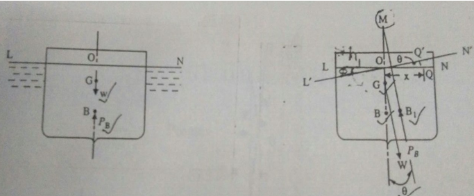
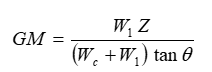
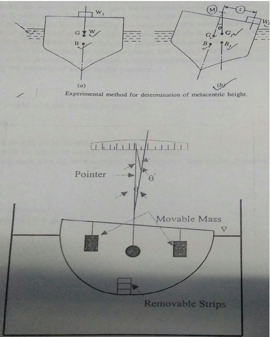

<b>Buoyancy</b>: When a body is immersed in a fluid either wholly of partially, it is buoyed or lifted up by a force, which is equal to the weight of fluid displaced by the body.  

<b>Centre of Buoyancy</b>: The point of application of the force of buoyancy on the body is known as the centre of buoyancy. It is always the centre of gravity of the volume of fluid displaced.  

<b>Metacentre:</b> Figure shows a body floating in a liquid in a state of equilibrium. When it is given a small angular displacement, it starts oscillating about some point M. This point, about which the body oscillating, it is called metacentre.   

The metacentre may also be defined as a point of intersection of the axis of body passing through centre of gravity G and original centre of buoyancy B and a vertical line passing through the centre of buoyancy B1 of the tilled position of the body.  
  
The experimental set up consists of a pontoon (flat bottomed vessel) which is allowed of float in a M.S. tank having a transparent side. Removable steel strips are placed in the model for the purpose of changing the weight of the vessel. By means of a pendulum (consisting of a weight suspended to a longer pointer), the angle of tilt θ can be measured on a graduated arc. For tilting the ship model a cross bar with two movable hangers is fixed on the model. Pendulum and graduated arc are suitably fixed at the centre of the cross bar.  

<b>Determination of Metacentric Height</b>  
A known weight W1 is shifted by a distance Z across the axis of tilt. The change in momentum due to this shift is W1 Z. Let the angle of tilt be θ. The change in moment due to this tilt is equal to (Wc + W1) GM tanθ.  

  

Wc = weight of the vessel 
W1 = weight of unbalanced mass 
Z = distance of the unbalanced mass from the centre of the cross bar. 

  
<b>DATA</b>  

Area of Tank (A) = 2500 cm2 
Unit weight of water (w) = 1 gm/cm3

